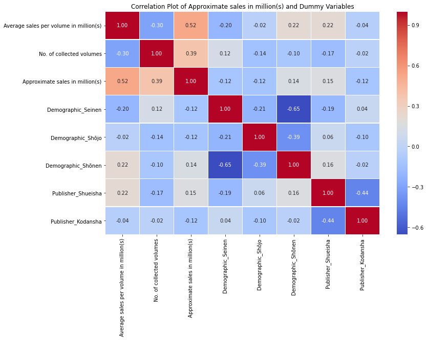
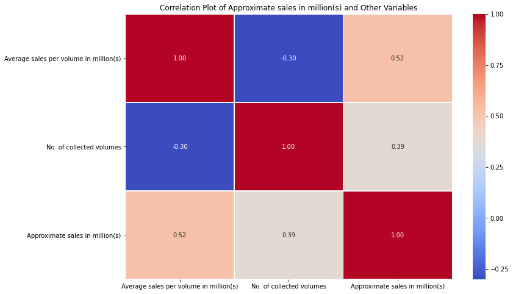
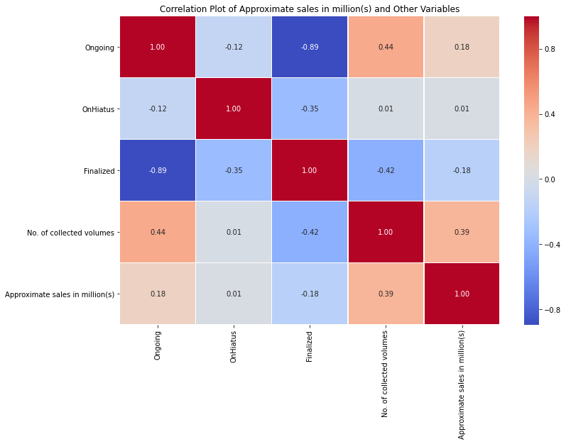

# IndividualProj_COMP-3125
Individual Project for Data Science Fundamentals for Fall 2023

**Introduction**
  My chosen dataset is "best-selling-manga", it was obtainet from Kaggle.com. It was an interesting data for me, because this is a form of media that I read quite often. Obviously older long run manga series will gain a lot sales simply because they would have a lot more volumes than youger manga series, but they are also few and there are a lot pof ouliers of manga where it suddenly gained track and started selling a lot more. Because of the sudden gain of popularity for some new series I was curious if there were relation between genre/volume numbers and sales. If this, where I assumed as a sudden event, could actually be predicted. I chose this dataset because I want to learn how to do linear regression on Python and practice on it. It would be a nice dataset to familiarize myself with Python's linear regression.

| Variables | Description |
|:----: | :--- |
|Manga series | 187 Unique Titles. Ordered based on "Approximate sales in million(s)" variable. |
|Author | Who is/are the Author(s) of this manga series.|
|Publisher | This manga series is published under which publishing company.|
|Demographic | Who is the main target audiance of this manga series. |
|No. of collected volumes | How many volumes have been published on this manga series. |
|Serialized | How long was the run of this manga series. |
| Approximate sales in million(s) | Lowest at 20, Highest at 516.6. |
| Average sales per volume in million(s) | Lowest at 0.19, Highest at 10. |

**Questions**
1. What is the most popular Author/Publisher/Demographic?
2. Assuming Number of Collected Volumes affects Sales what is the correlation between them?
3. Can we safely predict sales in milions(s) based on the variables in the dataset?

**Methods**
1. sklearn.model_selection and train_test_split - Training and Testing models.
2. pandas. - Read and modify the dataset.
3. matplotlib and Seaborn - Testing correlation between variables with a heatmap.
4. sklearn.linear_model and LinearRegression - Create a Linear Regression model to check if Sales in millions(s) can be predicted through the variables in the dataset. So if a manga meets certain requirements on other feature variables can we safely predict how many millions the manga would make through sales. 
5. sklearn.metrics and mean_squared_error and r2_score - Check if the prediction model is reliable and could be trusted for any assorted set of training and testing datas. 

**Results**
For the first question: "What is the most popular Author/Publisher/Demographic?" was simple to answer. Just needed to run the command: df['desired_variable'].value_counts(). Due to a few variables repeating but not being counted as the same categorical value I ran the replacing command to modify the variables that were the same company or a combination of demographics into a new categorical value. 
After modifications to make the list of authors, publishers and demograpphics cleaner visually I made them into histograms for better visual display.
The results are:
Most popular Author = Rumiko Takahashi.
Most popular Publisher = Shueisha.
Most popular Demographic = Shōnen. 

Interestly, Authors are pretty diverse, Rumiko has 4 books in the top 180 of best-selling-manga and a few other authors appears 2 or 3 times, but the majority appear only once. So Rumiko is clearly an outlier. 
Publishers is skewed to the right but after the 4th highest publisher it is obvious it it is a exponential decay.
Demographic Shonen is the highest by a big margin. It is over the double of the second highest demographic, Seinen.
For context the demographic categories are:
Shōnen: Manga targeted at tween and teen boys.
Shōjo: Manga targeted at tween and teen girls.
Seinen: Manga targeted at adult men (18+).
Josei: Manga targeted at adult women (18+).
Children: Manga target at children.
Multi: Manga targeted for multiple demographics.

For the second question: "Assuming Number of Collected Volumes affects Sales what is the correlation between them?". Once again was a simple vizualization answer, however I wanted to check as much as possible if there were no correlations in the dataset so there were a few alterations to my heatmaps. The safest assumption is that the more volumes a manga series have the longer it has been running so the more sales it would have had since it would have a bigger fanbase and loyal fans so even its average should be higher than a newer series that became popular suddenly.
However, that is not what the heatmaps revealed. None of the variables were related to sales, highest positive correlation in the dataset was between "Average sales per volume in million(s)" and "Approximate sales in million(s)", which is to be expected since these are both sales in millions. Even then, there correlation was only of 0.52, which although above a 50%, it is not a significant correlation. 

This is the heatmap for the dummy variables I created from the Serialized variable. Based on the dates provided in the Serialized collumn, three boolean variables were created to inform if the manga series was Ongoing, Finalized or On Hiatus. 
Obviously, Finalized and Ongoing are negatively correlated. Other than that there is not signoficant correlation in this heatmap.

This is a heatmap for the relationship of "Approximate sales in million(s)" and the volume variables, as I mentioned before I wanted to test if longevity was related to sales, as that is my main question.

This is a heatmap between the sales, volumes, and most popular demographics and publishers. To check if popularity publisher or demographic could give an edge to sales.

For the third question: "Can we safely predict sales in milions(s) based on the variables in the dataset?"
I divided the dataset on 70% training and 30% testing. So the dataset was split up in a randomized way.
After doing a few linear regression models I was able to conclude that the best predicting variables for the "Approximate sales in million(s)" variable was the two volume based variables: "Average sales per volume in million(s)" and "No. of collected volumes". I attemped also making demographic and publisher into dummy variables, however that actually consistently brought down the effectiveness from the model to below 60%. So I decided to stay with the two variables as that had a wide R-squared range between 63% and 73%. Although, not great given the dataset does not provide a lot of numerical variables. But a solid R-square value that has chance to be improved by other models. 

**Discussions**
The answer might imply my original assumption that longevity might lead to higher sales of a manga. If I can work more on this project later I will attempt to improve the dataset by also including how many years the manga series ran for. 
If I could modify the dataset further to experiment more I would add variables regarding anime adaptations. Was the manga series adapted into an anime? By which studio? Since there is a more clear bias to certain studios compared to publishers. I would include release schudule frequesncy, there are manga that are updated weekly and that increases sales and fans hype, and there are manga where it might be updated only every couple months.  How many official languages does the manga series have translations for, although the main target is japanese audiance, there are some that pick up on sales in other countries. Lastly I would increase the number of rows to at least 500 rows. 

It is not a lot of change, but I believe these variables could have opened mpre possibilities to playing around with the dataset.

I attempted a random forest model for this project, since I am already familiar with it in other coding languages, however I cou ld not make it work. It might have been because of the variable I was using since I attempted to used a dummy variable version of Publisher to see if it is possible to predict the most popular manga series based on Publisher and sales. If I continue to work on this project, my next step is to be able to make the RF model work. 

