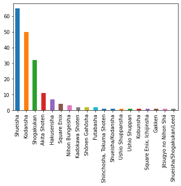
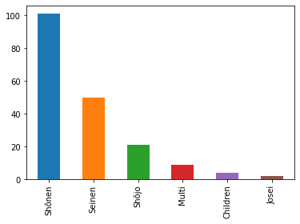

# IndividualProj_COMP-3125
Individual Project for Data Science Fundamentals for Fall 2023

**Introduction**
  My chosen dataset is "best-selling-manga", it was obtainet from Kaggle.com. It was an interesting data for me, because this is a form of media that I read quite often. Obviously older long run manga series will gain a lot sales simply because they would have a lot more volumes than youger manga series, but they are also few and there are a lot pof ouliers of manga where it suddenly gained track and started selling a lot more. Because of the sudden gain of popularity for some new series I was curious if there were relation between genre/volume numbers and sales. If this, where I assumed as a sudden event, could actually be predicted. I chose this dataset because I want to learn how to do linear regression on Python and practice on it. It would be a nice dataset to familiarize myself with Python's linear regression.

| Variables | Description |
|:----: | :--- |
|Manga series | 187 Unique Titles. Ordered based on "Approximate sales in million(s)" variable. |
|Author | Who is/are the Author(s) of this manga series.|
|Publisher | This manga series is published under which publishing company.|
|Demographic | Who is the main target audiance of this manga series. |
|No. of collected volumes | How many volumes have been published on this manga series. |
|Serialized | How long was the run of this manga series. |
| Approximate sales in million(s) | Lowest at 20, Highest at 516.6. |
| Average sales per volume in million(s) | Lowest at 0.19, Highest at 10. |

**Questions**
1. What is the most popular Author/Publisher/Demographic?
2. Assuming Number of Collected Volumes affects Sales what is the correlation between them?
3. Can we safely predict sales in milions(s) based on the variables in the dataset?

**Methods**
1. sklearn.model_selection and train_test_split - Training and Testing models.
2. pandas. - Read and modify the dataset.
3. matplotlib and Seaborn - Testing correlation between variables with a heatmap.
4. sklearn.linear_model and LinearRegression - Create a Linear Regression model to check if Sales in millions(s) can be predicted through the variables in the dataset. So if a manga meets certain requirements on other feature variables can we safely predict how many millions the manga would make through sales. 
5. sklearn.metrics and mean_squared_error and r2_score - Check if the prediction model is reliable and could be trusted for any assorted set of training and testing datas. 

**Results**
For the first question: "What is the most popular Author/Publisher/Demographic?" was simple to answer. Just needed to run the command: df['desired_variable'].value_counts(). Due to a few variables repeating but not being counted as the same categorical value I ran the replacing command to modify the variables that were the same company or a combination of demographics into a new categorical value. 
After modifications to make the list of authors, publishers and demograpphics cleaner visually I made them into histograms for better visual display.
The results are:
Most popular Author = Rumiko Takahashi.
Most popular Publisher = Shueisha.
Most popular Demographic = Shōnen. 

Interestly, Authors are pretty diverse, Rumiko has 4 books in the top 180 of best-selling-manga and a few other authors appears 2 or 3 times, but the majority appear only once. So Rumiko is clearly an outlier. 
Publishers is skewed to the right but after the 4th highest publisher it is obvious it it is a exponential decay.
Demographic Shonen is the highest by a big margin. It is over the double of the second highest demographic, Seinen.
For context the demographic categories are:
Shōnen: Manga targeted at tween and teen boys.
Shōjo: Manga targeted at tween and teen girls.
Seinen: Manga targeted at adult men (18+).
Josei: Manga targeted at adult women (18+).
Children: Manga target at children.
Multi: Manga targeted for multiple demographics.

